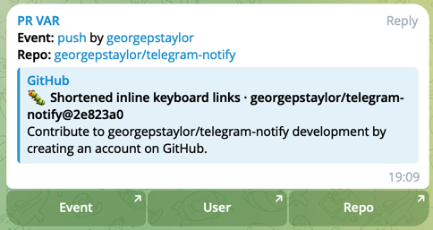

# Telegram Notify

This action sends a Telegram message to a specified chat based on the
GitHub event that triggered the action.

It currently supports the following event triggers:
* Pull Request
* Issue
* Push

## Usage example

```yaml
name: Notify Telegram
on:
  issue_comment:
    types:
      - created
  issues:
    types: [opened, edited, pinned, closed, reopened, assigned]
  pull_request:
    types: [opened, closed, edited, ready_for_review, review_requested, reopened]
  pull_request_review_comment:
    types:
      - created
  push:
    branches:
      - main

jobs:
 test:
    runs-on: ubuntu-latest
    steps:
      - name: Test
        uses: georgepstaylor/telegram-github-notifier@v0.0.1
        with:
          telegram_bot_token: ${{ secrets.TELEGRAM_BOT_TOKEN }}
          telegram_chat_id: ${{ secrets.TELEGRAM_CHAT_ID }}
          gh_event: ${{ toJson(github.event) }}
          gh_actor: ${{ github.actor }}
```

It is important to note that the `gh_event` input is required and must be a JSON string. 
This is because the action needs to parse the event to determine the message to send to Telegram.

## Example output

